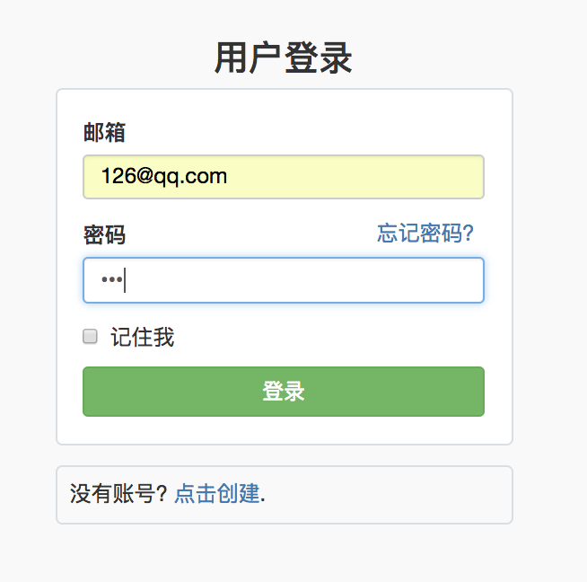
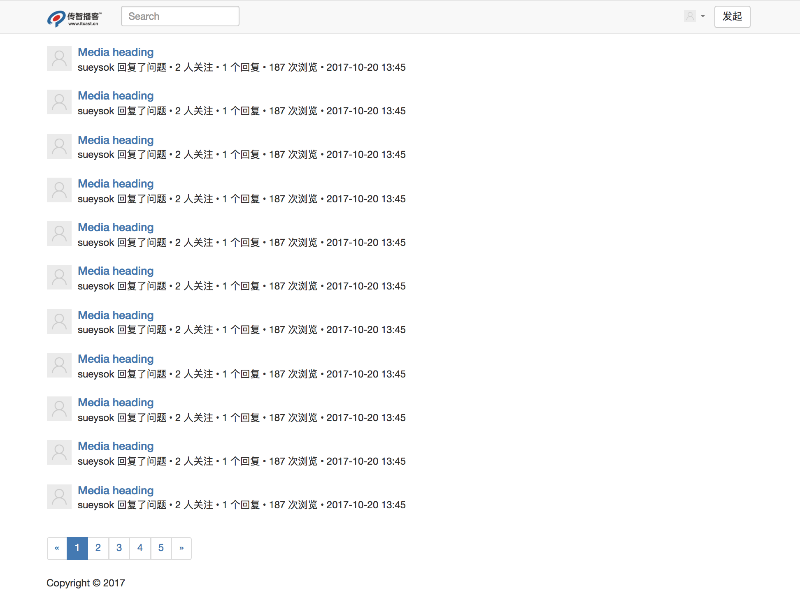
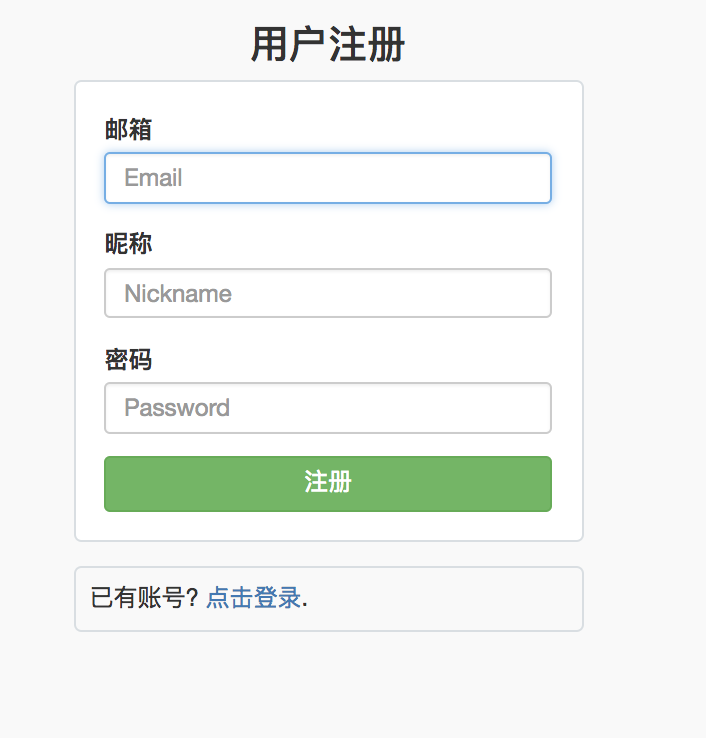

# 仿CNode的多人博客管理系统
## 技术栈

- express——开启服务的框架
- MongoDB——数据库

- Mongoose——操作数据库
- art-template——模版引擎
- express-art-template
- md5——密码加密
- session——管理数据登录状态

## 实现功能 

- 登录
- 注册
- 首页退出

## 路由设计

| 路径      | 方法 | get参数 | post参数                  | 是否需要权限（登录） | 备至         |
| --------- | ---- | ------- | ------------------------- | -------------------- | ------------ |
| /         | GET  |         |                           |                      | 渲染首页     |
| /register | GET  |         |                           |                      | 渲染注册页面 |
| /register | POST |         | email、nickname，password |                      | 处理注册请求 |
| /login    | GET  |         |                           |                      | 渲染登录页面 |
| /login    | POST |         | email，password           |                      | 处理登录请求 |
| /logout   | GET  |         |                           |                      | 处理退出请求 |

## 项目结构

├── README.md 
├── package-lock.json 
├── package.json 
├── node_modules 
├── app.js 
├── router.js 
├── models 
│   ├── comment.js 
│   ├── topic.js 
│   └── user.js 
├── public 
│   ├── css 
│   │   ├── login.css 
│   │   ├── main.css 
│   │   ├── markdown-github.css 
│   │   └── settings.css 
│   ├── img 
│   │   ├── avatar-default.png 
│   │   ├── avatar-max-img.png 
│   │   └── logo3.png 
│   └── js 
├── views 
│   ├── _layouts 
│   │   └── home.html 
│   ├── _partials 
│   │   ├── footer.html 
│   │   ├── header.html 
│   │   └── settings-nav.html 
│   ├── index.html 
│   ├── login.html 
│   ├── register.html 
│   ├── settings 
│   │   ├── admin.html 
│   │   └── profile.html 
│   └── topic 
│       ├── edit.html 
│       ├── new.html 
│       └── show.html 

## 截图
   
   - ### 登录

   - ### 首页

   - ### 注册页
